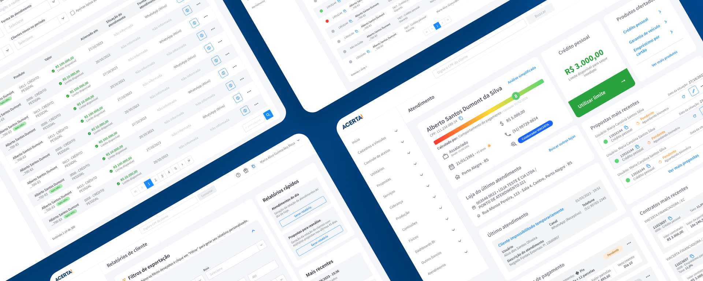
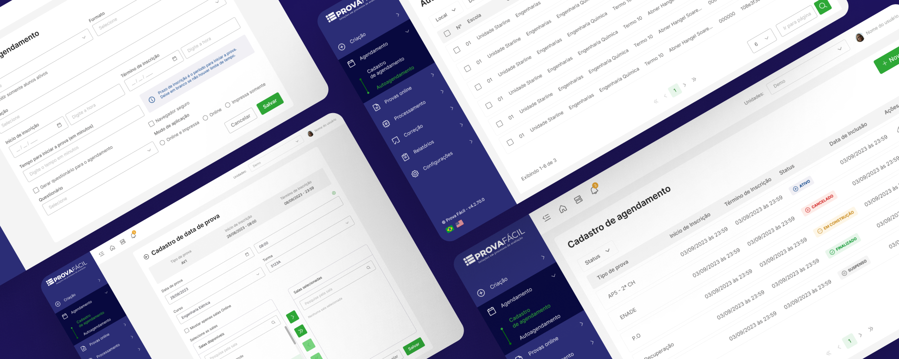
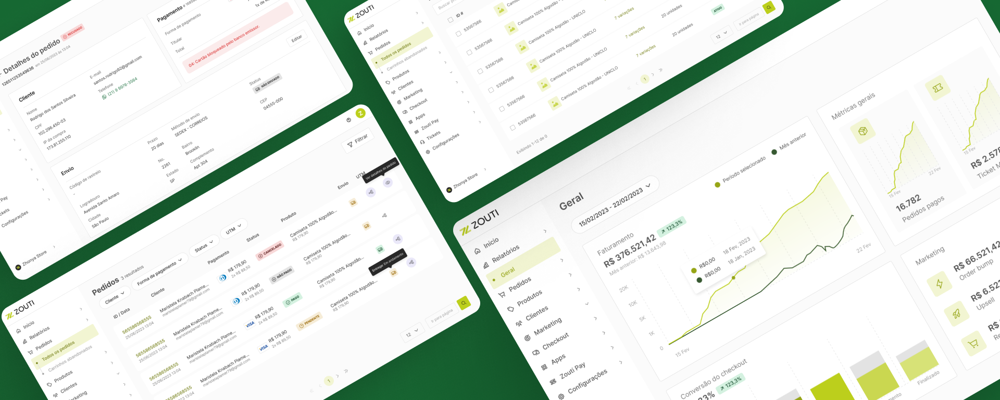

### 🌟 Welcome to my **UI Design portfolio**! 🌟

#### Here, I showcase some of the **UI Design** projects I've worked on. Each project represents my passion for creating intuitive and visually appealing user experiences.

# 🚀 Projects I've worked on

### [2024-2023] Acerta! Promotora

🧩 Design System

- [[AP] Design System - Components](https://www.figma.com/design/7stZu84smWutAwDseRoDwj/ACERTA!-DS----%F0%9F%A7%A9-Components?node-id=1918%3A643&t=S0p2qQuqIB0oxA6H-1)
- [[AP] Design System - Foundation](https://www.figma.com/design/FvHkI8XVn865pgSCDAYCvm/ACERTA!-DS---%F0%9F%A7%B1-Foundations?node-id=1918%3A643&t=xMIOjbgx6kJLojKx-1)

💻 Projects

- [Customer Service Screen](https://www.figma.com/design/p2tkZ15D2k090bIgq9k564/Tela-de-atendimento?node-id=0%3A1&t=xe8X2qyfxLmPZpho-1)
- [Sales Flow](https://www.figma.com/design/VDmwqbhjHmSO9vfp038xks/Fluxo-de-vendas?node-id=409%3A15588&t=1FujHydaQeml0Qfw-1)
- [Proposal consult](https://www.figma.com/design/ilUQKWKiCV21igD1Ghs5lk/Consulta-de-propostas?node-id=152%3A715&t=lYo4vlgqgIg7MMtJ-1)
- [Mailing](https://www.figma.com/design/cbnEdy9pgxOCrQ51EYbkRw/Extra%C3%A7%C3%A3o-de-Clientes?node-id=79%3A2561&t=HQfT3qrDG5zFPiP7-1)
- [Client with limit](https://www.figma.com/design/9zLwXTBTNtR3FSeohPPRu6/Clientes-com-limite?node-id=30%3A10867&t=pSYZ1Hp3MONy4UNr-1)

---

### [2023] Prova Fácil

🧩 Design System

- [[PF] Design System](https://www.figma.com/design/M9wD5NpDKkvf6EqKz1KVEu/Design-System?node-id=7%3A838&t=3PFXmlXrMsNSzeKR-1)

💻 Projects

- [Appointment Registration](https://www.figma.com/design/ZM3IgLB2UfalGQc3AsP71q/Cadastro-de-Agendamento?node-id=0%3A1&t=7l4Vfed946lb9gxk-1)
- [Self-Scheduling](https://www.figma.com/design/is80VdTN9LGL655ICXTgXC/Autoagendamento?node-id=0%3A1&t=7nVhgR894Qzh1XyC-1)

---

### [2023] Zouti

🧩 Design System

- [[ZT] Design System](https://www.figma.com/design/0m2TBhXwNcFSvflaOmF3OL/%5BZouti%5D---Style-Guide?node-id=1%3A20655&t=tACKrrp2TBHdmBfJ-1)

💻 Projects

- [Product List](https://www.figma.com/design/B9IqLwHmhfi6SpDkZj4goH/Produtos?node-id=0%3A1&t=g9nK2WEark5xVy8f-1)
- [General Report](https://www.figma.com/design/WcSSfLfWuQnj2r7FgM8Bvz/Relat%C3%B3rio-Geral?node-id=96%3A1882&t=SOsZ1cA6VIMH2SOx-1)
- [Checkout Config](https://www.figma.com/design/Ux8jp21OU4K5AY5wwcJpRF/Checkout?node-id=946%3A4444&t=Wbb5AyOg2a0l3BFQ-1)
- [Configuration](https://www.figma.com/design/NC3u9ILqQicKUtu6NL3hDY/Configura%C3%A7%C3%B5es?node-id=1%3A3&t=cVUVb79Vj9nNVN6K-1)
- [Marketing](https://www.figma.com/design/JH3NwA5jieB9cUD4MiiFHV/Marketing?node-id=611%3A2131&t=b2EyTXJCr7odqENO-1)
- [Order](https://www.figma.com/design/sNnWQteHei3q8QL0m68iwD/Pedidos?node-id=0%3A1&t=R5LxyPnv3dI1tbgn-1)

---

### [2022 - 2020] Delinea

🧩 Design System

- [[DS] Design System](https://www.figma.com/design/ifqok4gBYY61YtARZkus37/%F0%9F%A7%A9-DStore---Design-System?node-id=235%3A1920&t=JKvT8Nwj1ScY0bd7-1)

💻 Projects

- [DStore](https://www.figma.com/design/V6G5tHEqenx3vc3ox0pjD1/DStore-Loja?node-id=191%3A4843&t=slNoaS5Qwwcq9qFi-1)  
- [Dashboard Admin System](https://www.figma.com/design/5pZoR5DKqPkhjyfprVAe8s/Dashboard---%5BDstore%5D?node-id=2%3A22&t=4ZTZbXWBcXCZVSsc-1)
- [Content Management](https://www.figma.com/design/tEXapjgtlwnB3njtNSt77B/Gerenciamento-de-Materiais---%5BDstore%5D?node-id=2%3A22&t=y52dyk0I9ncHEjya-1)
- [User Management](https://www.figma.com/design/79Ll4u1h80jkONgXXYx3je/Gerenciamento-de-usu%C3%A1rios---%5BDstore%5D?node-id=201%3A2910&t=eis8Qqy9ZhtQpGZf-1)
- [Create Course](https://www.figma.com/design/dGbx3HVoaxOMahEbzpeWM3/Feature-de-criar-curso?node-id=0%3A1&t=vIo4X64FouKxK1pS-1)
- [Revenue](https://www.figma.com/design/vowvWLnc6fIMtXyxFZsdxP/Faturamento---%5BDstore%5D?node-id=201%3A2910&t=GjGHK80sjmtECuH2-1)

